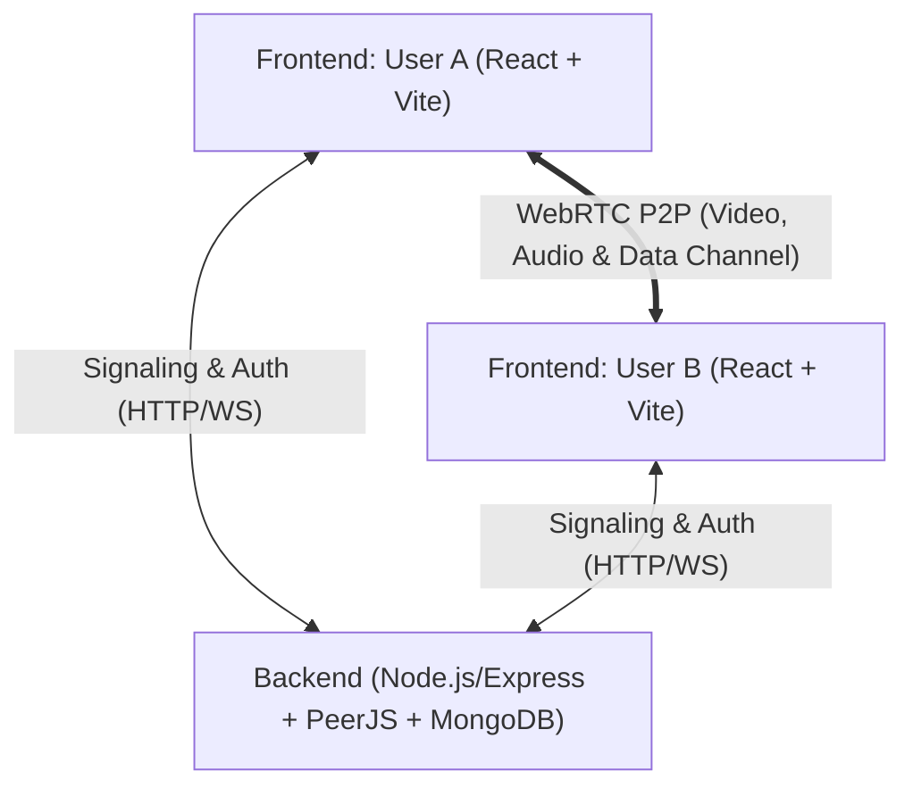

# 🎬 WatchParty

WatchParty is a real-time synchronized video streaming and screen-sharing web application featuring peer-to-peer (WebRTC) audio/video calling. It allows users to watch YouTube videos in perfect synchronization or share their desktop screen while interacting via live, draggable webcam feeds.

---

## ✨ Features

- **📺 Synchronized YouTube Playback (`/room`)**:
  - Watch YouTube videos together in real time.
  - Play, pause, seek, and URL changes automatically synchronize between connected peers over WebRTC data channels.
  - Fullscreen mode with draggable camera feeds.

- **🖥️ Real-Time Screen Sharing (`/screen-share`)**:
  - Low-latency screen and window sharing using the browser's `getDisplayMedia` API.
  - Stream shared display content alongside video calling tiles.

- **📞 WebRTC Audio & Video Calling**:
  - Direct peer-to-peer (P2P) communication powered by PeerJS.
  - STUN and TURN fallback support for reliable NAT traversal.
  - Live microphone volume visualizer using the Web Audio API (`AudioContext` and `AnalyserNode`).
  - Draggable, floating camera cards (`react-draggable`) over the video player.
  - Mic mute/unmute and Camera on/off toggles with remote status indicators.

- **🔐 User Authentication & Sessions**:
  - Secure user signup and login with hashed passwords (`bcrypt`).
  - Session verification and protected routes using JSON Web Tokens (JWT).

---

## 🏗️ Architecture & Tech Stack



### Frontend (`watch-party`)
- **Framework**: React 19 + Vite
- **Styling**: Tailwind CSS + Custom CSS (Glassmorphism & animations)
- **WebRTC & Streaming**: `peerjs`
- **Video Player**: `react-youtube` (YouTube IFrame Player API wrapper)
- **UI Components & Icons**: `react-draggable`, `lucide-react`, `react-router-dom`

### Backend (`watch-party-backend`)
- **Runtime & Framework**: Node.js + Express
- **Signaling**: `ExpressPeerServer` (PeerJS Server mounted at `/myapp`)
- **Database**: MongoDB with Mongoose
- **Security & Auth**: `jsonwebtoken` (JWT), `bcrypt`, `cors`, `dotenv`
- **NAT Traversal**: TURN/STUN credential endpoints (`/api/turn-credentials`)

---

## 📁 Project Structure

```
watchParty/
├── watch-party/                      # Frontend Application
│   ├── src/
│   │   ├── hooks/
│   │   │   ├── useWatchPartyCall.js  # WebRTC peer connections, mic/cam, calling lifecycle
│   │   │   ├── useWatchPartyVideo.js # YouTube video play/pause/seek synchronization
│   │   │   └── useScreenShareCall.js # Screen capture & peer stream management
│   │   ├── App.jsx                   # Application routing & JWT session verification
│   │   ├── LandingPage.jsx           # Landing / Hero page
│   │   ├── LoginPage.jsx             # User login form
│   │   ├── SignupPage.jsx            # User registration form
│   │   ├── WatchPartyRoomRefactored.jsx # YouTube synchronized room UI
│   │   ├── ScreenShareRoom.jsx       # Screen sharing room UI
│   │   ├── index.css                 # Core CSS design tokens & layout
│   │   └── main.jsx                  # React entry point
│   ├── package.json
│   └── vite.config.js
│
└── watch-party-backend/              # Backend Signaling & Auth Server
    ├── models/
    │   └── User.js                   # Mongoose User schema (username, email, password)
    ├── server.js                     # Express server, PeerJS signaling, Auth & TURN APIs
    ├── package.json
    └── .env                          # Backend environment variables
```

---

## 🔄 How Video Synchronization Works

1. **Room Pairing**: Users share a 6-character room ID to establish a WebRTC Peer-to-Peer Data Channel and Media Stream.
2. **URL Loading**: When User A loads a YouTube link, an event `{ type: "LOAD_VIDEO", videoId }` is broadcast over the data channel to User B.
3. **Play / Pause / Seek Sync**:
   - When User A interacts with the player, `handlePlay` or `handlePause` captures the current video timestamp.
   - A message `{ type: "PLAY", time }` or `{ type: "PAUSE", time }` is sent to User B.
   - User B's player seeks to `time` and reflects the action while an `isRemoteActionRef` flag temporarily prevents infinite broadcast loops.
4. **Media State Broadcast**: When a user mutes their mic or toggles their camera, `{ type: "MEDIA_STATE", mic, cam }` is transmitted so the peer's UI updates dynamically.

---

## 🚀 Getting Started

### 1. Prerequisites
- [Node.js](https://nodejs.org/) (v18 or higher recommended)
- [MongoDB](https://www.mongodb.com/) (Local instance or MongoDB Atlas cluster)

### 2. Backend Setup
```bash
cd watch-party-backend
npm install
```

Create a `.env` file in `watch-party-backend/` with the following variables:
```env
PORT=9000
MONGODB_URI=your_mongodb_connection_string
JWT_SECRET=your_jwt_secret_key
TURN_IP=your_turn_server_ip
TURN_USERNAME=your_turn_username
TURN_CREDENTIAL=your_turn_password
```

Start the backend server:
```bash
npm start
```

### 3. Frontend Setup
```bash
cd watch-party
npm install
npm run dev
```

Open your browser at `http://localhost:5173`.

---

## 📡 API Endpoints

| Method | Endpoint | Description |
| :--- | :--- | :--- |
| `POST` | `/api/register` | Register a new user account |
| `POST` | `/api/login` | Authenticate user and receive JWT token |
| `GET` | `/api/verify` | Verify current JWT token session |
| `GET` | `/api/turn-credentials` | Retrieve ICE servers (STUN/TURN config) |
| `GET` | `/health` | Health check endpoint |
| `WS/HTTP` | `/myapp` | PeerJS WebRTC signaling endpoint |
