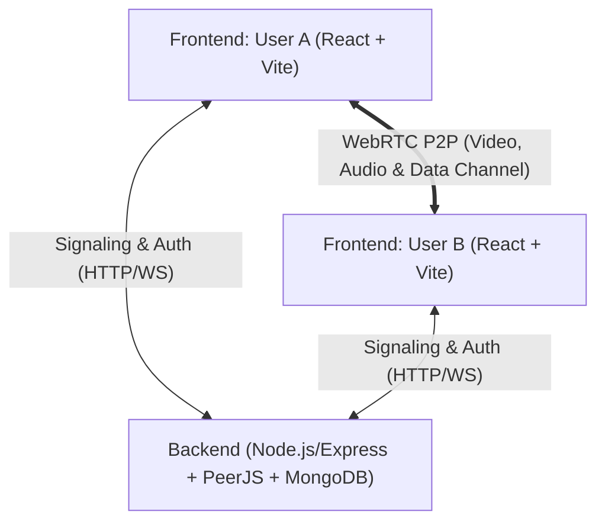

# 🎬 WatchParty

WatchParty is a real-time synchronized video streaming, local media playback, and screen-sharing web application featuring peer-to-peer (WebRTC) audio/video calling. It allows users to seamlessly navigate between watching YouTube videos, syncing their own local video files, or sharing their desktop screens—all while staying connected via live, draggable webcam feeds.

---

## ✨ Features

- **📺 Synchronized YouTube Playback (`/party`)**:
  - Watch YouTube videos together in real time.
  - Play, pause, seek, and URL changes automatically synchronize between connected peers over WebRTC data channels.
  - Fullscreen mode with floating, draggable camera feeds.

- **📁 Synchronized Local Video Playback (`/local-sync`)**:
  - Watch local video files (MP4, MKV, WebM, etc.) synchronously with friends without uploading files to any external server.
  - Precise Play, Pause, and Seek synchronization with responsive custom media controls.
  - Safe mobile autoplay handling with deferred-play resolution (`pendingPlayTimeRef`) and feedback loop protection (`isRemoteActionRef`).
  - Real-time peer file status indicators (`Friend loaded: filename`).

- **🖥️ Real-Time Screen Sharing (`/screen-share`)**:
  - Low-latency screen and window sharing using the browser's `getDisplayMedia` API.
  - Stream shared display content alongside video calling tiles.

- **📞 WebRTC Audio & Video Calling**:
  - Direct peer-to-peer (P2P) communication powered by PeerJS.
  - STUN and TURN fallback support for reliable NAT traversal.
  - Live microphone volume visualizer using the Web Audio API (`AudioContext` and `AnalyserNode`).
  - Draggable, floating camera cards (`react-draggable`) over the video player.
  - Mic mute/unmute and Camera on/off toggles with remote status indicators and polished UI overlays.

- **🎨 Modern UI & Experience**:
  - Persistent Dark/Light Mode using `localStorage` and a unified glassmorphism design system.
  - **Peer-to-Peer Navigation Sync**: When one user changes rooms (e.g. from YouTube to Screen Share), the connected peer is automatically notified and navigated to the same room seamlessly via `CallContext` events.

- **🔐 User Authentication & Sessions**:
  - Secure user signup and login with hashed passwords (`bcrypt`).
  - Session verification and protected routes using JSON Web Tokens (JWT).

---

## 🏗️ Architecture & Tech Stack



### Frontend (`watch-party`)
- **Framework**: React 19 + Vite
- **Styling**: Tailwind CSS + Custom Vanilla CSS (Glassmorphism, animations, responsive layouts)
- **State Management**: React Context (`CallContext`) for global WebRTC state and peer navigation syncing.
- **WebRTC & Streaming**: `peerjs`
- **Video Players**:
  - `react-youtube`: Embedded YouTube player with programmatic playback control
  - Native HTML5 `<video>`: Custom synced controller for local media files
- **UI Components & Icons**: `react-draggable`, `lucide-react`, `react-router-dom`

### Backend (`watch-party-backend`)
- **Runtime & Framework**: Node.js + Express
- **Signaling**: `ExpressPeerServer` (PeerJS Server mounted at `/myapp`)
- **Database**: MongoDB with Mongoose
- **Security & Auth**: `jsonwebtoken` (JWT), `bcrypt`, `cors`, `dotenv`
- **NAT Traversal**: TURN/STUN credential endpoints (`/api/turn-credentials`)

---

## 📁 Project Structure

```
watchParty/
├── watch-party/                      # Frontend Application
│   ├── src/
│   │   ├── context/
│   │   │   └── CallContext.jsx       # Global state for Peer connections & Navigation syncing
│   │   ├── hooks/
│   │   │   ├── useWatchPartyCall.js  # WebRTC peer connections, mic/cam, calling lifecycle
│   │   │   ├── useWatchPartyVideo.js # YouTube video play/pause/seek synchronization
│   │   │   ├── useLocalVideoParty.js # Local video playback & playback sync controller
│   │   │   └── useScreenShareCall.js # Screen capture & peer stream management
│   │   ├── App.jsx                   # Application routing & JWT session verification
│   │   ├── LandingPage.jsx           # Landing / Hero page
│   │   ├── LoginPage.jsx             # User login form
│   │   ├── SignupPage.jsx            # User registration form
│   │   ├── WatchPartyRoomRefactored.jsx # YouTube synchronized room UI (`/party`)
│   │   ├── LocalVideoPartyRoom.jsx   # Local video sync room UI (`/local-sync`)
│   │   ├── ScreenShareRoom.jsx       # Screen sharing room UI (`/screen-share`)
│   │   ├── index.css                 # Core CSS design tokens & layout
│   │   └── main.jsx                  # React entry point
│   ├── package.json
│   └── vite.config.js
│
└── watch-party-backend/              # Backend Signaling & Auth Server
    ├── models/
    │   └── User.js                   # Mongoose User schema (username, email, password)
    ├── server.js                     # Express server, PeerJS signaling, Auth & TURN APIs
    ├── package.json
    └── .env                          # Backend environment variables
```

---

## 🔄 How Video & Navigation Synchronization Works

1. **Room Pairing**: Users share a 6-character room ID to establish a WebRTC Peer-to-Peer Data Channel and Media Stream.
2. **Navigation Sync**: When User A switches rooms (e.g. clicking the "Share Screen" tab), a `{ type: "ROUTE_CHANGE", route }` event is broadcasted over the data channel, forcing User B's router to follow suit.
3. **YouTube Video Sync**:
   - When User A loads a YouTube link, `{ type: "LOAD_VIDEO", videoId }` is broadcast to User B.
   - Play/pause/seek triggers send `{ type: "PLAY", time }` or `{ type: "PAUSE", time }`.
4. **Local Video Sync**:
   - Both users choose their local file on their respective machines.
   - When a user loads a file, `{ type: "FILE_LOADED", fileName }` is sent to notify the peer.
   - On Play/Pause/Seek, commands are transmitted over the WebRTC data channel.
   - Guard refs (`isRemoteActionRef`) prevent circular command loops, and deferred playback (`pendingPlayTimeRef`) handles mobile autoplay restrictions gracefully.
5. **Media State Broadcast**: When a user mutes their mic or toggles their camera, `{ type: "MEDIA_STATE", mic, cam }` is transmitted so the peer's UI updates dynamically (e.g., showing the Camera Off overlay).

---

## 🚀 Getting Started

### 1. Prerequisites
- [Node.js](https://nodejs.org/) (v18 or higher recommended)
- [MongoDB](https://www.mongodb.com/) (Local instance or MongoDB Atlas cluster)

### 2. Backend Setup
```bash
cd watch-party-backend
npm install
```

Create a `.env` file in `watch-party-backend/` with the following variables:
```env
PORT=9000
MONGODB_URI=your_mongodb_connection_string
JWT_SECRET=your_jwt_secret_key
TURN_IP=your_turn_server_ip
TURN_USERNAME=your_turn_username
TURN_CREDENTIAL=your_turn_password
```

Start the backend server:
```bash
npm start
```

### 3. Frontend Setup
```bash
cd watch-party
npm install
npm run dev
```

Open your browser at `http://localhost:5173`.

---

## 📡 API Endpoints

| Method | Endpoint | Description |
| :--- | :--- | :--- |
| `POST` | `/api/register` | Register a new user account |
| `POST` | `/api/login` | Authenticate user and receive JWT token |
| `GET` | `/api/verify` | Verify current JWT token session |
| `GET` | `/api/turn-credentials` | Retrieve ICE servers (STUN/TURN config) |
| `GET` | `/health` | Health check endpoint |
| `WS/HTTP` | `/myapp` | PeerJS WebRTC signaling endpoint |
